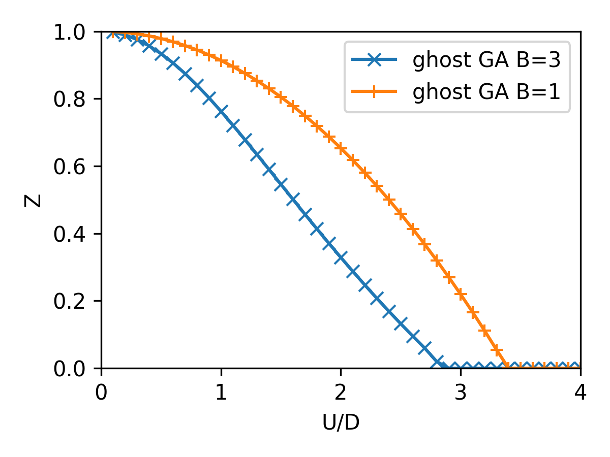
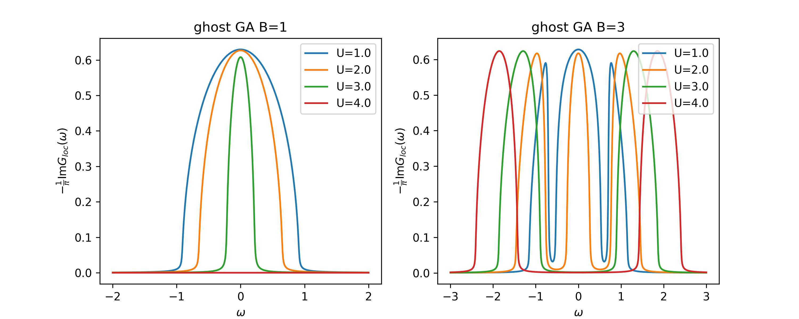

.. _example_bethe_1orb:

Single-Orbital Hubbard Model (Bethe Lattice)
============================================

**Script:** ``examples/Bethe_1orb.py``

In this example we will address the most canonical example of calculation
for local quantum embedding theories that is solving the single orbital
Hubbard model on the Bethe lattice (semicircular DOS, half-bandwidth
:math:`D = 1`) performing a sweep over the Hubbard :math:`U`.
In this calculation we will enforce spin SU(2) symmetry and we will track
the quasiparticle weight :math:`Z` as a function of :math:`U`, revealing the
Mott metal-insulator transition.

Setup
-----

We start from importing the necessary modules::

    import numpy as np
    import matplotlib.pyplot as plt
    from gem.lattice import Lattice
    from gem.fragment import Fragment
    from gem.solvers.simple_ed import SimpleED

We sample the semicircular DOS on a fine energy mesh, we use to build the
dispersion array and relative weights, and we use them to initialize the lattice object::

    # 1 orbital x 2 spins, B=3 bath orbitals per spin 
    nimp, B = 2, 3
    nbath, ntot = nimp * B, nimp + nimp * B

    # semicircular DOS on a fine energy mesh
    e_list = np.linspace(-1, 1, 5001)
    wks = np.sqrt(1 - e_list**2); wks /= wks.sum()
    eks = np.array([np.kron([[e]], np.eye(2)) for e in e_list])

    lattice = Lattice(eks, wk_list=wks)

Self-consistency loop
---------------------

For each value of :math:`U` the embedding local Hamiltonian is built and a solver object is created.
Those will be the inputs of the Fragment object that and the
ghost-GA equations are iterated to convergence::

    U = 2.5
    eloc = np.diag([-U/2, -U/2])
    Utensor = np.zeros((nimp,)*4)
    Utensor[0, 0, 1, 1] = Utensor[1, 1, 0, 0] = U

    solver   = SimpleED(ntot, use_Ntot=True, use_Sz=True,
                        N_sector=ntot//2, Sz_sector=0,
                        dtype=np.complex128)
    fragment = Fragment(nimp, nbath, eloc, Utensor, solver)

    mu, T, mix, tol = 0.0, 0.0, 0.5, 1e-5
    for it in range(100):
        lattice.solve_qp([fragment], T=T)
        fragment.update_hybridization(T=T)
        fragment.impose_spin_SU2_symmetry()
        fragment.solve_impurity(mu, T=T, num_eig=10)

        Lambda_old, R_old = fragment.Lambda.copy(), fragment.R.copy()
        fragment.update_self_energy(T=T)
        fragment.impose_spin_SU2_symmetry()

        diff = max(np.abs(fragment.Lambda - Lambda_old).max(),
                   np.abs(fragment.R      - R_old     ).max())
        fragment.Lambda = (1 - mix)*fragment.Lambda + mix*Lambda_old
        fragment.R      = (1 - mix)*fragment.R      + mix*R_old
        fragment.impose_spin_SU2_symmetry()
        if diff < tol and it > 2:
            break

    Z = fragment.compute_Z()

Note that, since we are working with a paramagnetic solution, the local Hamiltonian is spin-symmetric and the solver is set to work
in the subspace of fixed total particle number and magnetization via the ``use_Ntot`` and ``use_Sz`` flags
and indicating the corresponding sectors `N_sector=ntot//2` and `Sz_sector=0`.
The call to ``impose_spin_SU2_symmetry`` after each step enforces that the
:math:`\uparrow` and :math:`\downarrow` sectors remain identical, keeping the
solution in the paramagnetic state throughout the sweep.
When performing single site calculations, the quasiparticle weight can be computed from local self-energy
and the fragment object provides a method ``compute_Z`` to do so.

Results
-------

Performing the sweep over :math:`U` and plotting the resulting :math:`Z(U)` curve, we can clearly see the Mott transition and the difference in critical interaction
between the standard GA (:math:`B=1`, orange) and ghost GA (:math:`B > 1` , in this case :math:`B=3`, blue ):

Additionally, we can check how the spectral function evolves across the transition, by plotting the imaginary part of the local lattice Green's function.
The lattice Green's function is computed from the lattice object via the method ``get_G_loc`` directly on the real-frequency axis passing an array of frequencies and a small imaginary broadening::

     w_list = np.linspace(-3, 3, 500)
     G_loc_w = lattice.get_G_loc(w_list, [fragment], eps=1e-2)[0]

The resulting spectral functions for the different values of :math:`U` are shown in the following figure:

The disappearence of the quasiparticle peak after the Mott transition is clearly visible for both :math:`B=1` and :math:`B=3`.
Although, only the latter is able to capture the Mott gap opening at the transition.