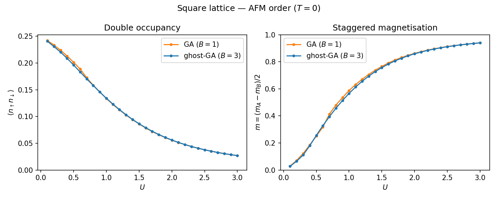

.. _example_square_afm:

Square Lattice — Antiferromagnetic Order (T = 0)
================================================

**Script:** ``examples/Square_1orb_2frag.py``

In this example we study the single-orbital Hubbard model on the square
lattice at zero temperature and look for antiferromagnetic (AFM) order.
The square lattice has a nested Fermi surface, which makes it especially
susceptible to spin-density-wave instabilities, and therefore a natural
test case for broken-symmetry ghost-GA calculations.

A two-site unit cell is used, with one fragment per sublattice (A and B).
The two fragments are allowed to develop opposite spin polarisations by
*not* imposing spin SU(2) symmetry.  A sweep over the Hubbard :math:`U`
is performed and the double occupancy :math:`\langle n_\uparrow n_\downarrow \rangle` and staggered
magnetisation :math:`m = n_\uparrow - n_\downarrow` are extracted from
each converged solution.

Setup
-----

We start by importing the necessary modules::

    import numpy as np
    from gem.fragment import Fragment
    from gem.lattice import Lattice
    from gem.solvers.simple_ed import SimpleED

We consider one orbital with two spin components (``nimp = 2``) and ``B`` ghost orbitals per spin channel (``B = 1`` being GA and ``B > 1`` being ghost GA)::

    B = 1
    nimp = 2
    nbath = nimp * B
    ntot  = nimp + nbath

The square-lattice Brillouin zone is sampled on a uniform
:math:`100 \times 100` k-grid.
We set the nearest-neighbour hopping amplitude to :math:`t = 0.25` so that the non-interacting half-bandwidth is the unit of energy.
The two-site unit cell gives an off-diagonal
hopping :math:`\gamma_\mathbf{k}`, and the single-particle Hamiltonian is
built in the combined (site, spin) basis via a Kronecker product::

    Nk = 100
    Kx = np.linspace(-np.pi, np.pi, Nk, endpoint=False)
    Ky = np.linspace(-np.pi, np.pi, Nk, endpoint=False)
    t  = 0.25

    ek_list = []
    for kx in Kx:
        for ky in Ky:
            gamma_k = -t * (1.0
                        + np.exp(-1j * (kx + ky))
                        + np.exp(-1j * ky)
                        + np.exp(-1j * kx))
            Hk_spinless = np.array([[0.0, gamma_k],
                                    [gamma_k.conj(), 0.0]], dtype=np.complex128)
            ek_list.append(np.kron(Hk_spinless, np.eye(2)))

    eks = np.array(ek_list)
    wks = np.ones(len(ek_list)) / len(ek_list)
    lattice = Lattice(eks, wk_list=wks)

Self-consistency loop
---------------------

For each value of :math:`U` a pair of fragment objects is created, one
per sublattice, sharing the same local Hamiltonian, both local energy via the matrix ``eloc`` and the interaction
tensor ``Utensor`` which encodes the on-site Hubbard repulsion between spin-up and spin-down
electrons, but they will carry independent variational parameters :math:`\mathcal{R}`, :math:`\Lambda`, :math:`\mathcal{D}` and :math:`\Lambda_c`.
Since the Hamiltonian preserve the total particle number and the z-component of the total spin, the impurity solvers
are initialized to take advantage of the symmetry sectors at fixed :math:`N_\mathrm{tot}` and :math:`S_z` via the flags ``use_Ntot`` and ``use_Sz``::

    eloc = np.zeros((nimp, nimp))
    eloc[0, 0] = -U / 2.
    eloc[1, 1] = -U / 2.

    Utensor = np.zeros((nimp, nimp, nimp, nimp))
    Utensor[0, 0, 1, 1] = U
    Utensor[1, 1, 0, 0] = U

    edsolverA = SimpleED(ntot, use_Ntot=True, use_Sz=True,
                         N_sector=ntot//2, dtype=np.complex128)
    edsolverB = SimpleED(ntot, use_Ntot=True, use_Sz=True,
                         N_sector=ntot//2, dtype=np.complex128)
    fragmentA = Fragment(nimp, nbath, eloc, Utensor, edsolverA,
                         Lambda=Lambda0, R=R0)
    fragmentB = Fragment(nimp, nbath, eloc, Utensor, edsolverB,
                         Lambda=Lambda0, R=R0)

The ghost-GA self-consistency loop is then run for up to ``itmax``
iterations with a linear mixing ``mix`` between the new and old variational
parameters::

    for it in range(itmax):
        lattice.solve_qp([fragmentA, fragmentB], T=T)

        fragmentA.update_hybridization(T=T)
        fragmentB.update_hybridization(T=T)

        # seeding AFM order... See below for details

        fragmentA.solve_impurity(mu, T=T)
        fragmentB.solve_impurity(mu, T=T)

        Lambda_old_A, R_old_A = fragmentA.Lambda.copy(), fragmentA.R.copy()
        Lambda_old_B, R_old_B = fragmentB.Lambda.copy(), fragmentB.R.copy()

        fragmentA.update_self_energy(T=T)
        fragmentB.update_self_energy(T=T)

        diff = max(
            np.abs(fragmentA.Lambda - Lambda_old_A).max(),
            np.abs(fragmentA.R      - R_old_A     ).max(),
            np.abs(fragmentB.Lambda - Lambda_old_B).max(),
            np.abs(fragmentB.R      - R_old_B     ).max(),
        )
        fragmentA.Lambda = (1 - mix)*fragmentA.Lambda + mix*Lambda_old_A
        fragmentA.R      = (1 - mix)*fragmentA.R      + mix*R_old_A
        fragmentB.Lambda = (1 - mix)*fragmentB.Lambda + mix*Lambda_old_B
        fragmentB.R      = (1 - mix)*fragmentB.R      + mix*R_old_B

        if diff < tol and it > 2:
            break

Seeding AFM order
-----------------

A self-consistency iteration will in principle be satisfied by the
paramagnetic solution (equal spin populations on both sublattices) even
when the ordered phase is the true ground state.  To bias the iteration
towards the AFM solution, a small symmetry-breaking Zeeman field with
opposite sign on the two sublattices is applied to the on-site energies
during the first few iterations::

    if it < 3:
        fragmentA.eloc = eloc + bfield * np.diag([-1,  1])
        fragmentB.eloc = eloc - bfield * np.diag([-1,  1])
    else:
        fragmentA.eloc = eloc.copy()
        fragmentB.eloc = eloc.copy()

Once the field is removed, if the system is in the ordered phase the
solution remains magnetised because the two fragments have already
developed a finite :math:`R` and :math:`\Lambda` asymmetry.  In the
paramagnetic phase the solution relaxes back to :math:`m = 0`.

Extracting the results
-----------------------

After convergence, the double occupancy is computed from each
fragment, and the magnetisation on each sublattice is read from the
impurity block of the converged one-body density matrix::

    docc_A = fragmentA.compute_docc()
    docc_B = fragmentB.compute_docc()

    dm_A = fragmentA.denMat[:nimp, :nimp].real # local impurity density matrix of fragment A
    dm_B = fragmentB.denMat[:nimp, :nimp].real # local impurity density matrix of fragment B
    mA = dm_A[0, 0] - dm_A[1, 1]   # n_↑ - n_↓ on sublattice A
    mB = dm_B[0, 0] - dm_B[1, 1]   # n_↑ - n_↓ on sublattice B

In the ordered phase :math:`m_A = -m_B \neq 0` by symmetry of the
two-sublattice unit cell.

Results
-------

The following figures show the double occupancy :math:`\langle n_\uparrow n_\downarrow \rangle` and the
staggered magnetisation :math:`m` as a function of :math:`U` for the
square-lattice Hubbard model at zero temperature.

The double occupancy :math:`\langle n_\uparrow n_\downarrow \rangle` decreases with increasing :math:`U` as the system becomes more correlated and the staggered magnetisation :math:`m` increases monotonically with increasing :math:`U`.

At small :math:`U` the system is a paramagnet (:math:`m = 0`), while
above a critical :math:`U_c` a finite staggered magnetisation develops.
The onset of magnetic order coincides with a reduction of the
quasiparticle weight :math:`Z`, reflecting the increased effective mass
of carriers in the AFM phase.
